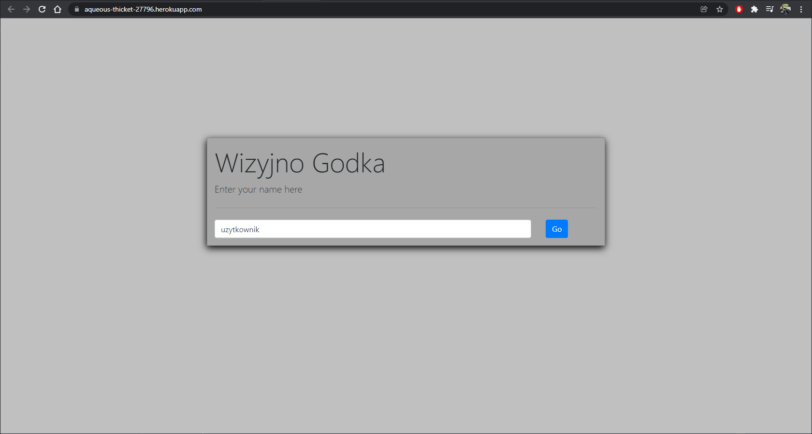
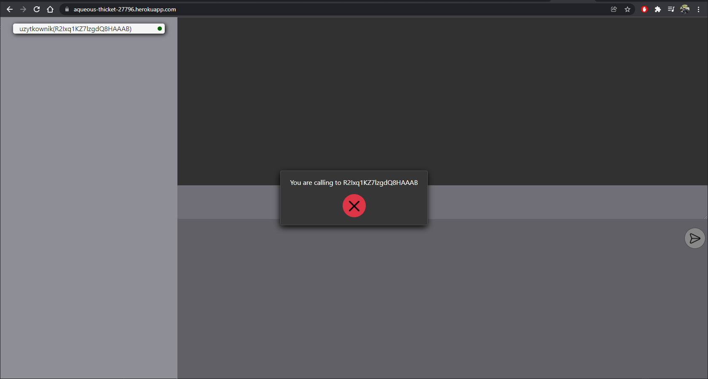

# WizyjnoGodka
## Spis treści
- [Cel projektu](#cel_projektu)
- [Zasada działania](#zasada_dzialania)
- [Opis API](#opis_api)
- [Demo](#demo)
- [Wykorzystane narzędzia](#wykorzystane_narzedzia)
- [Instrukcja instalacji i uruchomienia](#instrukcja_instalacji_i_uruchomienia)
- [Licencja](#licencja)

## Cel_projektu
Celem projektu było zaimplementowanie prostego komunikatora, pozwalającego na prowadzenie rozmów z wykorzystaniem strumieniowania wideo oraz audio.

## Zasada_dzialania
Wizyjno Godka jest aplikacją webową, gdzie serwer chodzi lokalnie na porcie 8000, natomiast aplikacja na porcie 3000
Serwer aplikacji jest oparty o aiohttp czyli asynchroniczny serwer http w Python.
Dodatkowo używana jest w nim biblioteka socketio, aby serwer ten mógł się komunikować z frontem aplikacji przez WebRTC.
Warstwa wizualna aplikacji jest zbudowana przy użyciu React.js oraz wspomnianego juz WebRTC 
Wybraliśmy takie rozwiązanie ze względu na dobre wynik WebRTC w strumieniowaniu wideo.

Zasada działania serwera opiera się na prostych strukturach przechowujących informacje o zalogowanych uzytkownikach, bieżących zaproszeniach oraz liście pokoi
Istnieje natomiast sporo socketowych endpointów, które pozwalają aplikacji na ustanowienie połączenia WebRTC oraz reagować na elementarne zdarzenia takie jak przyjmowanie/odrzucanie zaproszeń, rozłączanie, wyciszanie mikrofonu itp. 
Poniżej znajduje się opis wszystkich endpointów.

## Opis_api

Endpoint 'connections' emituje listę wszystkich podłązonych użytkowników w formacie JSON.

```python
@sio.on('connections')
async def get_users(sid):
    str = users_list.get_user_list_in_json(sid)
    logger.info(f"sending data to {sid}: {str}")
    await sio.emit('connections', data=str, to=sid)
```

Endpoint 'candidate' emituje dane 'candidate' adresata potrzebne do utworzenia połączenia
peer to peer z użytkownikiem odbierającym.

Dane 'candidate' znane jako kandydat ICE wymieniają dostępne metody, za pomocą których peer jest w stanie się komunikować (bezpośrednio lub poprzez serwer TURN). Typowo, każdy z peerów będzie proponował najpierw swoich najlepszych kandydatów, a potem gorszych. Idealnie, kandydatami są UDP (ponieważ jest szybszy i strumienie mediów są w stanie stosunkowo łatwo powrócić do normalnego stanu po przerwaniu), ale standard ICE dopuszcza również kandydatury TCP.

```python
@sio.on('candidate')
async def candidate(sid, candidate_data):
    logger.info(f"Message from {sid}: {candidate_data}")
    to_sid = candidate_data['receiver_sid']
    await sio.emit('candidate', candidate_data, skip_sid=sid, to=to_sid)
```

Endpoint 'offer' emituje dane 'offer' adresata potrzebne do utworzenia połączenia
peer to peer z użytkownikiem odbierającym.

dane 'offer' zawierają informacje o wszelkich obiektach MediaStreamTrack już dołączonych do sesji WebRTC, kodeku i opcjach obsługiwanych przez przeglądarkę oraz wszelkich kandydatach już zebranych przez agenta ICE, w celu wysłania ich przez kanał sygnalizacyjny do potencjalnego peera, aby zażądać połączenia lub zaktualizować konfigurację istniejącego połączenia. 

```python
@sio.on('offer')
async def offer(sid, offer_data):
    logger.info(f"Message from {sid}: {offer_data}")
    to_sid = offer_data['receiver_sid']
    await sio.emit('offer', offer_data, skip_sid=sid, to=to_sid)
```

Endpoint 'answer' emituje wiadomość zwrotną

```python
@sio.on('answer')
async def answer(sid, answer_data):
    logger.info(f"Message from {sid}: {answer_data}")
    to_sid = answer_data['receiver_sid']
    await sio.emit('answer', answer_data, skip_sid=sid, to=to_sid)
```

Endpoint 'chat' emituje wiadomość od adresata do wszystkich odbiorców w wybranym pokoju

```python
@sio.on('chat')
async def pass_chat_data(sid, message):
    logger.info(f"chat message sent: {message}")
    try:
        if sio.rooms(sid)[0] != sid:
            await sio.emit('message', message, room=sio.rooms(sid)[0], skip_sid=sid)
        else:
            await sio.emit('message', message, room=sio.rooms(sid)[1], skip_sid=sid)
    except IndexError as e:
        logger.warning(f'index error in chat data: {e}')
```

Endpoint 'name' rozsyła do wszystkich połączonych socketów informacje o nazwie nowo podłaczonego użytkownika

```python
@sio.on('name')
async def pass_new_clients_name(sid, name):
    logger.info(f"name set to: {name}")
    for user in users_list.list_of_users:
        if user.compare(sid):
            user.set_name(name)
            json_object = users_list.parse_user_to_json(user)
            await sio.emit('add-connection', data=json_object, skip_sid=sid)
            break
```

Endpoint 'send-invitation' jest wywoływany w momencie, gdy sender_sid wysyła prośbę do receiver_sid o utworzenie pokoju. Jak można zauważyć, najpierw sprawdzane jest, czy sockety przypadkowo już nie są połaczone. Następnie sprawdzany jest, czy socket odbiorcy nie należy juz do innego pokoju (w tym przypadku emitowany jest sygnał z prośbą o dołączenie). Gdy socket recevier nie znajduje się w żadnym innym pokoju, to tworzony jest request i emitowany jest endpoint 'receive-invite', który spowoduje wyświetlenie informacji na ekranie odbiorcy, że użytkownik o danym socket id próbuje utworzyć połaczenie (można odrzucić lub przyjąć). Maksymalna liczba zaproszeń nie może być większa niż 5 i maksymalny timeout zaproszenai to 10 sekund.

```python
@sio.on('send-invitation')
@logger.catch
async def send_invitation(sender_sid, receiver_sid):
    for room in rooms_list:
        if rooms_list[room].are_sids_in_room(sender_sid, receiver_sid):
            logger.warning(f"sender sid: {sender_sid} & receiver sid: {receiver_sid} are already in the same room")
            await sio.emit('room-is-already-set', to=sender_sid)
            return

    for room in rooms_list:
        if rooms_list[room].if_sid_is_in_room(receiver_sid):
            logger.info(f"receiver sid: {receiver_sid} is already in the room")
            await sio.emit('room-is-already-set', to=sender_sid)
            await sio.emit('invitation-request', data={'sender_sid': sender_sid}, to=receiver_sid)
            return

    if invitations_list.count_same_invitations(sender_sid, receiver_sid) < 5:
        invitations_list.append(sender_sid, receiver_sid)
        logger.info(f"New pending invitation - sender sid: {sender_sid} & receiver sid: {receiver_sid}")

    str = json.dumps(Invitation(sender_sid, receiver_sid), indent=2, cls=EncodeInvitation)
    await sio.emit('receive-invite', data=str, to=receiver_sid)
    await sio.sleep(10)
    if invitations_list.invitation_exist(sender_sid, receiver_sid):
        await sio.emit('invite-expired-receiver', data=str, to=receiver_sid)
        await sio.emit('invite-expired-sender', data=str, to=sender_sid)
        invitations_list.remove(sender_sid, receiver_sid)
        logger.debug(f"invitation {sender_sid}->{receiver_sid} expired")
```

Endpoint 'accept-invitation' zostanie wywołany, gdy użytkownik do którego przychodzi połączenie potwierdzi połączenie. Z listy zaproszeń zostanie usunięte zaproszenie oraz zostaną wywołane dwa emity, 'invite-accepted' informujący nadawcę o zaakceptowaniu połaczenia oraz 'create-peer' po którym nastąpi próba utworzenia połaczenia peer-to-peer.

```python
@sio.on('accept-invitation')
async def accept_invitation(sid, data):
    new_data = json.loads(data)
    receiver_sid = new_data["receiver_sid"]
    sender_sid = new_data["sender_sid"]
    
    if invitations_list.invitation_exist(sender_sid, receiver_sid):
        if len(sio.rooms(sender_sid)) > 1:
            room = add_receiver_to_already_existed_room(sender_sid, receiver_sid)
        else:
            room = create_new_room_and_add_participants(sender_sid, receiver_sid)
        logger.info(f"{receiver_sid} accepted invitation from {sender_sid}")
        invitations_list.remove(sender_sid, receiver_sid)
        str = json.dumps(Invitation(sender_sid, receiver_sid), indent=2, cls=EncodeInvitation)
        await sio.emit('invite-accepted', data=str, to=sender_sid)

        json_list = rooms_list[room].get_all_sid_from_room()
        await sio.emit('create-peer', data={'room_id': room, 'peers': json_list}, room=room)
    else:
        logger.error(f"{sender_sid}->{receiver_sid} invitation not found")
```

Endpoint 'decline-invitation' zostanie wywołany w momencie, gdy adresat połączenia odrzuci zaproszenie. Wywoływane jest jeden emit 'invite-declined' zarówno do receiver socket sid oraz do sender socket sid. Sender socket_sid i receiver_sid otrzymają informacje o odrzuceniu połaczenia i dialog połączenia zostanie usunięty w aplikacji webowej. 

```python
@sio.on('decline-invitation')
async def decline_invitation(sid, data):
    new_data = json.loads(data)
    sender_sid = new_data["sender_sid"]
    receiver_sid = new_data["receiver_sid"]

    if invitations_list.invitation_exist(sender_sid, receiver_sid):
        invitations_list.remove(sender_sid, receiver_sid)
        logger.debug(f"invitation {sender_sid}->{receiver_sid} declined")
        str = json.dumps(Invitation(sender_sid, receiver_sid), indent=2, cls=EncodeInvitation)
        if sid == sender_sid:
            await sio.emit('invite-declined', data=str, to=receiver_sid)
        else:
            await sio.emit('invite-declined', data=str, to=sender_sid)
        for invitation in invitations_list.list_of_invitations:
            logger.debug(f"{invitation.sender_sid}->{invitation.receiver_sid}")
```

Endpoint 'leave-all-rooms' jest wywoływany, gdy wywołujący socket zamknie połączenie, lub zostanie rozłaczony z serwerm.

```python
@sio.on('leave-all-rooms')
async def decline_invitation(sid):
    logger.debug(f"before removal:{sio.rooms(sid)}")
    remove_from_all_rooms(sid)
    logger.debug(f"after removal:{sio.rooms(sid)}")
```

Endpoint 'toggle-mic' zostaje wywoływany przez socket w celu informacji pozostałych socketów w pokoju, że jego mikrofon został wyciszony, w tym momencie w aplikacja przestanie odbierać dane z mikrofonu konkretnego socket id.

```python
@sio.on('toggle-mic')
async def toggle_mic(sid):
    for room in sio.rooms(sid):
        if room != sid:
            await sio.emit('toggle-mic', data={'sender_sid': sid}, to=room)
```
Endpoint 'toggle-video' zostaje wywoływany przez socket w celu informacji pozostałych socketów w pokoju, że jego kamera została wyłączona, w tym momencie aplikacja przestanie odbierać dane z kamery  konkretnego socket id.

```python
@sio.on('toggle-video')
async def toggle_mic(sid):
    for room in sio.rooms(sid):
        if room != sid:
            await sio.emit('toggle-video', data={'sender_sid': sid}, to=room)
```

Endpoint 'leave-room' zostanie wywołany gdy socket, który wysyła request wyjdzie z pokoju.

```python
@sio.on('leave-room')
async def leave_rooms(sid):
    for custom_room in rooms_list:
        if rooms_list[custom_room].if_sid_is_in_room(sid):
            rooms_list[custom_room].remove_from_list(sid)

    for room in sio.rooms(sid):
        if room != sid:
            await sio.emit('remove-peer-connection', data={'sender_sid': sid}, room=room)
            sio.leave_room(sid, room)
```

## Demo
#### Ekran startowy

#### Próba nawiązania połączenia z wybranym użytkownikiem


Aplikacja została zamieszczona na platformie Heroku i można ją sprawdzić pod poniższym linkiem:
[SIIMZoomCloneApp na Heroku](https://aqueous-thicket-27796.herokuapp.com/)

## Wykorzystane_narzedzia
- [Python](https://www.python.org/downloads/)
    - [AIOHTTP](https://docs.aiohttp.org/en/stable/)
    - [SocketIO](https://python-socketio.readthedocs.io/en/latest/)

- [React.js](https://pl.reactjs.org/)
    - [WebRTC](https://webrtc.org/)
    - [SocketIO](https://socket.io/docs/v4/client-api/)

## Instrukcja_instalacji_i_uruchomienia

### Uruchomienie Lokalnie

#### Kroki dla clienta:
- `npm install`
- `npm start`

#### Kroki dla Serwera:
- `pip install -r ./requirements.txt`
- `python ./main.py`

### Uruchomienie przy pomocy konteneryzacji
#### Kroki dla docker-compose:
- `sudo docker-compose build`
- `sudo docker-compose up`

#### Kroki dla dockera:
##### Kroki dla clienta:
- `sudo docker build -t client .`
- `sudo docker run -dp 3000:3000 client -e IP_ADDRES='127.0.0.1'`

##### Kroki dla Serwera:
- `sudo docker build -t server .`
- `sudo docker run -dp 8000:8000 server`

## Licencja
- [MIT License](https://choosealicense.com/licenses/mit/)
- [Copyright 2020 © ](https://github.com/avresial/SIIMZoomCloneApp)
